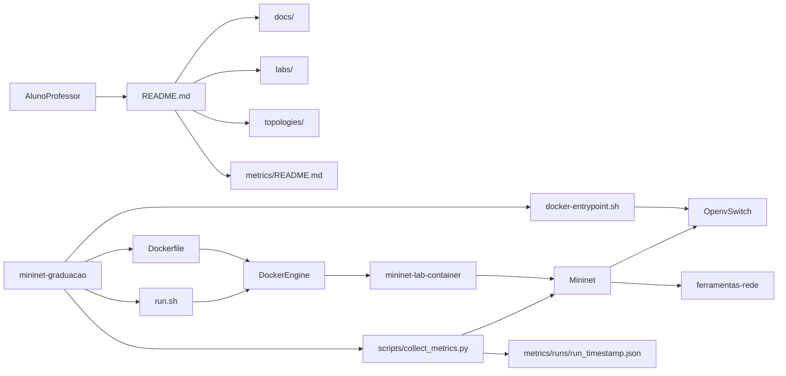
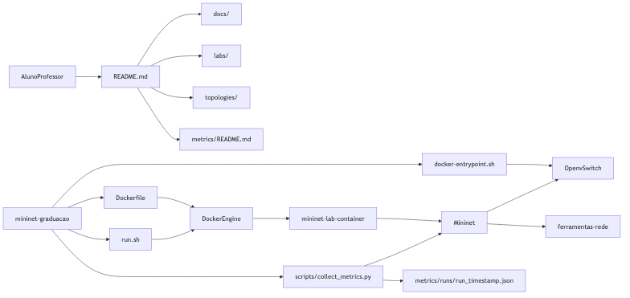

# Arquitetura do Projeto

Este documento descreve a arquitetura do projeto `mininet-graduação` para facilitar entendimento e manutenção.

## Visão geral

O projeto usa Docker para entregar um ambiente de laboratório consistente com Mininet, Open vSwitch e ferramentas de medição de rede. A operação didática é guiada por documentação (`README`, `docs/`, `labs/`) e por scripts de apoio (`run.sh` e `collect_metrics.py`).

## Diagrama de componentes

Versão estática (PNG):

O diagrama fonte está em [`diagrama-arquitetura.mmd`](diagrama-arquitetura.mmd).

## Fluxo de execução

1. Build da imagem com `docker build -t mininet-lab .`.
2. Execução do ambiente com `./run.sh`.
3. `docker-entrypoint.sh` inicializa `ovsdb-server` e `ovs-vswitchd`.
4. Aluno executa experimentos com Mininet (`mn`, `pingall`, `iperf`).
5. Coleta automatizada opcional com `collect-metrics` ou `python3 scripts/collect_metrics.py`.
6. Resultados em JSON salvos em `metrics/runs/`.

## Blocos principais

- **Ambiente Docker**: definido em `Dockerfile`, padroniza dependências de rede.
- **Inicialização OVS**: `docker-entrypoint.sh` garante socket e processos do Open vSwitch.
- **Execução do laboratório**: `run.sh` simplifica parâmetros de execução do container.
- **Topologias e labs**: `topologies/` e `labs/` estruturam as práticas da disciplina.
- **Métricas automatizadas**: `scripts/collect_metrics.py` coleta latência/perda/vazão e exporta JSON.
