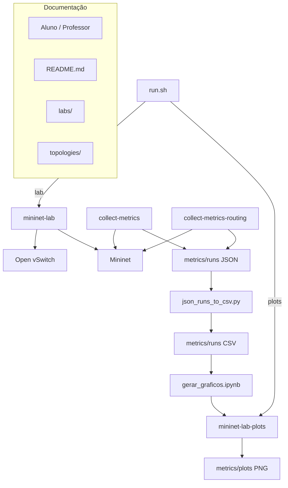

# Arquitetura do Projeto

Este documento descreve a arquitetura do projeto `mininet-graduação` (repositório `redes-ufam`).

## Visão geral

O projeto usa **duas imagens Docker**:

| Imagem | Dockerfile | Uso |
|--------|------------|-----|
| `mininet-lab` | `Dockerfile` | Práticas Mininet (Labs 1–3) |
| `mininet-lab-plots` | `Dockerfile.plots` | Notebook Jupyter → gráficos PNG |

A operação didática é guiada por `labs/`, `docs/` e pelo script `run.sh`.

## Diagrama de componentes

Versão estática (PNG): [`diagrama-arquitetura.png`](diagrama-arquitetura.png) — fonte em [`diagrama-arquitetura.mmd`](diagrama-arquitetura.mmd).

## Fluxo de execução

1. **Build:** `docker build -t mininet-lab .`
2. **Laboratório:** `./run.sh` (ou `./run.sh lab`) monta o repo em `/workspace` e define `MININET_LAB_ROOT=/workspace`.
3. **Entrypoint:** `docker-entrypoint.sh` inicia `ovsdb-server` e `ovs-vswitchd`.
4. **Prática manual:** `mn`, scripts em `topologies/`, ou CLI do Mininet após `python3 topologies/topo_lab3_routing.py`.
5. **Limpeza:** `exit` (se no `mininet>`) e `mn -c`.
6. **Coleta:** `collect-metrics` (Labs 1–2, topologia `h1-s1-h2`) ou `collect-metrics-routing` (Lab 3, `h1-r1-r2-h2`).
7. **JSON** em `metrics/runs/` (`run_*.json`, `routing_run_*.json`).
8. **CSV (opcional):** `python3 scripts/json_runs_to_csv.py` → `labs_1_2_runs.csv`, `lab3_runs.csv`.
9. **Gráficos (opcional):** `./run.sh plots` → PNG em `metrics/plots/`.

## `run.sh` — comandos

| Comando | Ação |
|---------|------|
| `./run.sh` / `lab` | Container `mininet-lab` interativo |
| `./run.sh plots` | Build `mininet-lab-plots`, converte JSON→CSV se necessário, executa notebook |
| `./run.sh plots-lab` | Jupyter Lab na porta 8888 |
| `./run.sh help` | Ajuda |

## Scripts em `scripts/`

| Script | No container | Função |
|--------|--------------|--------|
| `collect_metrics.py` | `collect-metrics` | Métricas Labs 1–2 |
| `collect_metrics_routing.py` | `collect-metrics-routing` | Métricas Lab 3 |
| `json_runs_to_csv.py` | `python3 scripts/...` | Agrega JSON em CSV |

Os coletores são copiados para `/opt/mininet-lab/scripts/` na imagem e expostos em `/usr/local/bin/`. Com `./run.sh`, use também `scripts/` em `/workspace` (volume).

## Onde os resultados são gravados

Ordem de prioridade da pasta de saída:

1. `--output-dir` (argumento do coletor)
2. `METRICS_OUTPUT_DIR`
3. `MININET_LAB_ROOT/metrics/runs` (recomendado com `./run.sh`)
4. `/opt/mininet-lab/metrics/runs` (sem volume)

## Blocos principais

- **Ambiente Docker (`Dockerfile`)**: Ubuntu 22.04, Mininet, OVS, iperf/iperf3, traceroute, Python 3.
- **Inicialização OVS**: `docker-entrypoint.sh`.
- **Topologias**: `topologies/` (inclui `topo_lab3_routing.py` para Lab 3).
- **Labs**: `labs/lab1_tcp.md`, `lab2_congestionamento.md`, `lab3_routing.md`.
- **Métricas**: coletores + `metrics/README.md`.
- **Visualização**: `Dockerfile.plots`, `notebooks/gerar_graficos.ipynb`, `metrics/plots/`.

## Material de aula

Slides: [`docs/aula/`](aula/).
